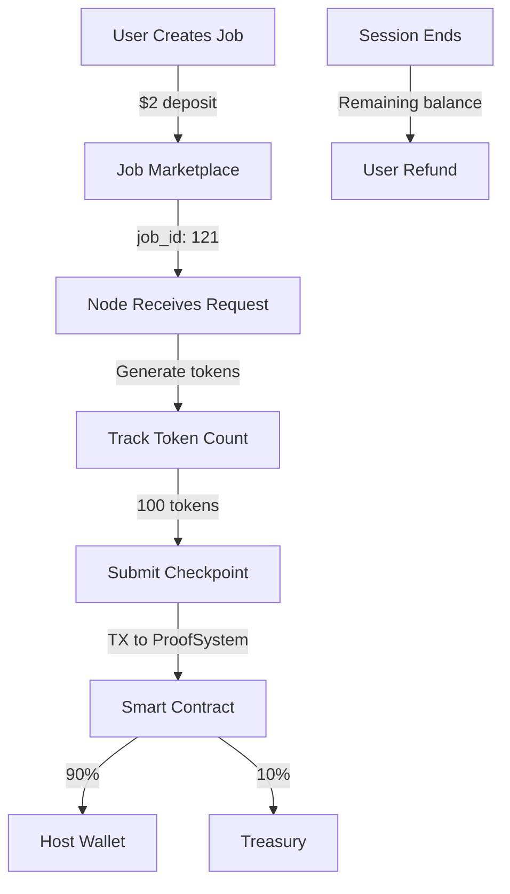

# Production Deployment with Payment Settlement

## Overview

The production restart scripts now support automatic payment settlement via blockchain checkpoint submission. Without proper configuration, hosts will process jobs but **receive ZERO payment**.

## Setup Requirements

### 1. Create `.env.test.local`

Copy the example and fill in your test credentials:

```bash
cp .env.test.local.example .env.test.local
```

Edit `.env.test.local`:
```bash
# Test Host Accounts (MUST be registered in NodeRegistry)
TEST_HOST_1_ADDRESS=0x123...  # Your first host address
TEST_HOST_1_PRIVATE_KEY=0xabc...  # Private key for host 1

TEST_HOST_2_ADDRESS=0x456...  # Your second host address
TEST_HOST_2_PRIVATE_KEY=0xdef...  # Private key for host 2

# Optional: Custom RPC
RPC_URL=https://base-sepolia.g.alchemy.com/v2/YOUR_KEY
```

### 2. Register Hosts (One-time Setup)

Before using the hosts, they must be registered on-chain:

```javascript
// Using the SDK or web3
const nodeRegistry = new NodeRegistryWithModels(registryAddress);

// Register host 1
await nodeRegistry.registerNode(
  TEST_HOST_1_ADDRESS,
  {
    endpoint: "ws://your-server:8080",
    models: ["tiny-vicuna"],
    // ... other metadata
  }
);

// Register host 2
await nodeRegistry.registerNode(
  TEST_HOST_2_ADDRESS,
  {
    endpoint: "ws://your-server:8083",
    models: ["tiny-vicuna"],
    // ... other metadata
  }
);
```

### 3. Fund Host Accounts

Each host needs ETH for gas fees:
- Minimum: 0.01 ETH on Base Sepolia
- Each checkpoint costs ~0.0002 ETH in gas

## Deployment Options

### Option 1: With Payment Settlement (Recommended)

```bash
# Requires .env.test.local with private keys
./restart-production-nodes-with-payments.sh
```

This script:
- ✅ Loads host private keys from `.env.test.local`
- ✅ Configures Web3 client for each node
- ✅ Enables automatic checkpoint submission
- ✅ Hosts get paid for compute

### Option 2: Original Script (Updated)

```bash
# Optionally uses .env.test.local if available
./restart-production-nodes-updated.sh
```

This script:
- Checks for `.env.test.local`
- If found: Enables payments
- If not found: Runs without payments (hosts get $0)

### Option 3: Without Payments (Original)

```bash
# No payment settlement
./restart-production-nodes.sh
```

This script:
- ❌ No checkpoint submission
- ❌ Hosts process jobs but get $0
- ❌ Users get full refund

## Verification

### Check Payment Initialization

After starting nodes, verify payment is enabled:

```bash
# Check Node 1
docker logs llm-node-prod-1 2>&1 | grep -A2 "Web3"

# Should see:
# 🔗 Initializing Web3 client for checkpoint submission...
# ✅ Checkpoint manager initialized - payments enabled!
```

### Monitor Checkpoint Submissions

```bash
# Watch Node 1 checkpoints
docker logs -f llm-node-prod-1 2>&1 | grep CHECKPOINT

# Watch Node 2 checkpoints
docker logs -f llm-node-prod-2 2>&1 | grep CHECKPOINT
```

Expected output when processing jobs:
```
📋 Processing inference request for blockchain job_id: 121
Generated 100 tokens for job 121
🔔 CHECKPOINT NEEDED for job 121 with 100 tokens!
Submitting checkpoint for job 121 with 100 tokens...
Checkpoint submitted successfully - tx_hash: 0x...
Checkpoint confirmed - payment distributed (90% host, 10% treasury)
```

### Verify on Blockchain

Check transactions on Base Sepolia:
```
https://sepolia.basescan.org/address/[HOST_ADDRESS]
```

Look for:
- Transactions to ProofSystem (0x2ACcc60893872A499700908889B38C5420CBcFD1)
- Method: `submitCheckpoint`
- Result: Payment received

## Payment Flow



## Troubleshooting

### No Payment Despite Processing

**Symptom**: Node processes jobs but host balance doesn't increase

**Check**:
```bash
docker logs llm-node-prod-1 2>&1 | grep "HOST_PRIVATE_KEY not set"
```

**Fix**: Create `.env.test.local` with private keys and restart

### "Only host can submit checkpoints" Error

**Symptom**: Checkpoint transaction fails

**Check**: Verify the private key matches registered host
```javascript
// In console
const registeredHost = await nodeRegistry.getNode(TEST_HOST_1_ADDRESS);
console.log("Is registered:", registeredHost.isActive);
```

**Fix**: Use correct private key for registered host address

### No Checkpoint Logs

**Symptom**: No "CHECKPOINT NEEDED" messages

**Check**:
```bash
# Verify job_id is received
docker logs llm-node-prod-1 2>&1 | grep "job_id"
```

**Fix**: Ensure SDK sends job_id with requests

## Best Practices

1. **Always use `.env.test.local`** for credentials (never commit!)
2. **Monitor checkpoint logs** during initial testing
3. **Check gas balance** before long sessions
4. **Verify registration** before deploying
5. **Test with small jobs** first (10-20 tokens)

## Quick Test

```python
# Test checkpoint submission
python3 test_checkpoint_submission.py

# Should generate 100+ tokens and trigger checkpoint
```

## Summary

| Script | Payment Support | When to Use |
|--------|----------------|-------------|
| `restart-production-nodes-with-payments.sh` | ✅ Required | Production with payments |
| `restart-production-nodes-updated.sh` | ✅ Optional | Flexible deployment |
| `restart-production-nodes.sh` | ❌ None | Testing only |

**Remember**: Without `HOST_PRIVATE_KEY`, hosts process jobs but receive **ZERO payment**!