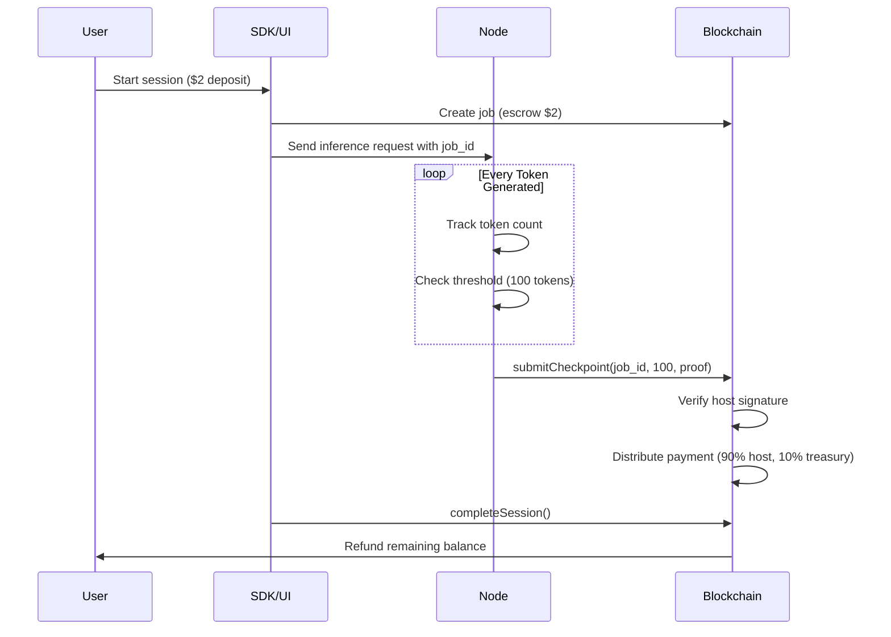

# Payment Settlement Flow - Complete Architecture

## The Correct Flow



## Why Only Hosts Can Submit Checkpoints

The smart contract `ProofSystem.submitCheckpoint()` requires:
```solidity
require(msg.sender == job.hostAddress, "Only host can submit checkpoints");
```

This prevents users from lying about compute usage.

## Current Implementation Status

### ✅ What's Working
1. **Token Tracking**: Node tracks tokens per job_id
2. **Threshold Detection**: Triggers at 100 tokens
3. **Force Checkpoint**: Submits remaining tokens on session end
4. **Web3 Integration**: Sends transactions to ProofSystem contract

### 🔴 What Hosts Must Do
```bash
# 1. Set environment variables
export HOST_PRIVATE_KEY=0x... # Their registered host private key
export RPC_URL=https://base-sepolia.g.alchemy.com/v2/...

# 2. Run the node
cargo run --release

# 3. Look for these logs
"🔗 Initializing Web3 client for checkpoint submission..."
"✅ Checkpoint manager initialized - payments enabled!"
```

### ⚠️ Common Issues

1. **No HOST_PRIVATE_KEY set**
   - Node runs but doesn't submit checkpoints
   - User gets full refund

2. **Wrong private key**
   - Checkpoint submission fails with "Only host can submit"
   - User gets full refund

3. **Insufficient gas**
   - Transaction fails
   - Node retries on next token

## How the Node Handles Checkpoints

### Token Tracking
```rust
// Every token generated
if let Some(job_id) = request.job_id {
    checkpoint_manager.track_tokens(job_id, 1, session_id).await;
}
```

### Checkpoint Submission
```rust
// When threshold reached (100 tokens)
if tokens_since_checkpoint >= CHECKPOINT_THRESHOLD {
    self.submit_checkpoint(job_id, tokens_generated).await;
}
```

### Session End
```rust
// Force checkpoint when streaming ends
if let Some(job_id) = job_id {
    checkpoint_manager.force_checkpoint(job_id).await;
    checkpoint_manager.cleanup_job(job_id).await;
}
```

## Testing Payment Flow

### 1. Start Node with Payments Enabled
```bash
HOST_PRIVATE_KEY=<test_host_key> cargo run --release
```

### 2. Send Request with job_id
```python
request = {
    "type": "inference",
    "request": {
        "job_id": 121,  # From blockchain
        "prompt": "Generate 150 tokens of text...",
        "max_tokens": 150
    }
}
```

### 3. Check Logs
```
Generated 100 tokens for job 121
🔔 CHECKPOINT NEEDED for job 121 with 100 tokens!
Submitting checkpoint for job 121 with 100 tokens...
Checkpoint submitted successfully - tx_hash: 0x...
Checkpoint confirmed - payment distributed (90% host, 10% treasury)
```

### 4. Verify Payment
- Check host balance increased
- Check treasury received 10%
- User refunded only remaining balance

## SDK Clarifications

### Q: Can UI/SDK trigger checkpoint submission?
**A: No.** Only the host can submit. The UI sends job_id, the node handles submission.

### Q: Why does completeSession() give full refund?
**A: Because no checkpoints were submitted.** The contract only knows about deposited funds, not work performed.

### Q: Is there a method we're missing?
**A: No.** The flow is:
1. UI creates job with escrow
2. Node submits checkpoints during work
3. UI completes session for final cleanup

## Deployment Instructions for Hosts

### 1. Register as Host
```javascript
// One-time registration
await nodeRegistry.registerNode(hostAddress, metadata)
```

### 2. Configure Node
```bash
# .env file
HOST_PRIVATE_KEY=0x...  # MUST match registered address
RPC_URL=https://base-sepolia...
MODEL_PATH=./models/llama.gguf
```

### 3. Run Node
```bash
# With payment settlement enabled
source .env
cargo run --release
```

### 4. Monitor Checkpoints
```bash
# Watch for checkpoint logs
cargo run --release 2>&1 | grep CHECKPOINT
```

## Troubleshooting Checklist

- [ ] Is HOST_PRIVATE_KEY set?
- [ ] Does private key match registered host address?
- [ ] Is the node receiving job_id in requests?
- [ ] Are tokens being tracked? (check logs)
- [ ] Is checkpoint threshold reached? (100 tokens)
- [ ] Does host have ETH for gas?
- [ ] Is RPC_URL correct for Base Sepolia?

## Summary

**The payment settlement is already implemented in the node.** The issue is that hosts aren't running with `HOST_PRIVATE_KEY` set, so checkpoints aren't being submitted to the blockchain. Once hosts configure their nodes correctly, payments will flow automatically.